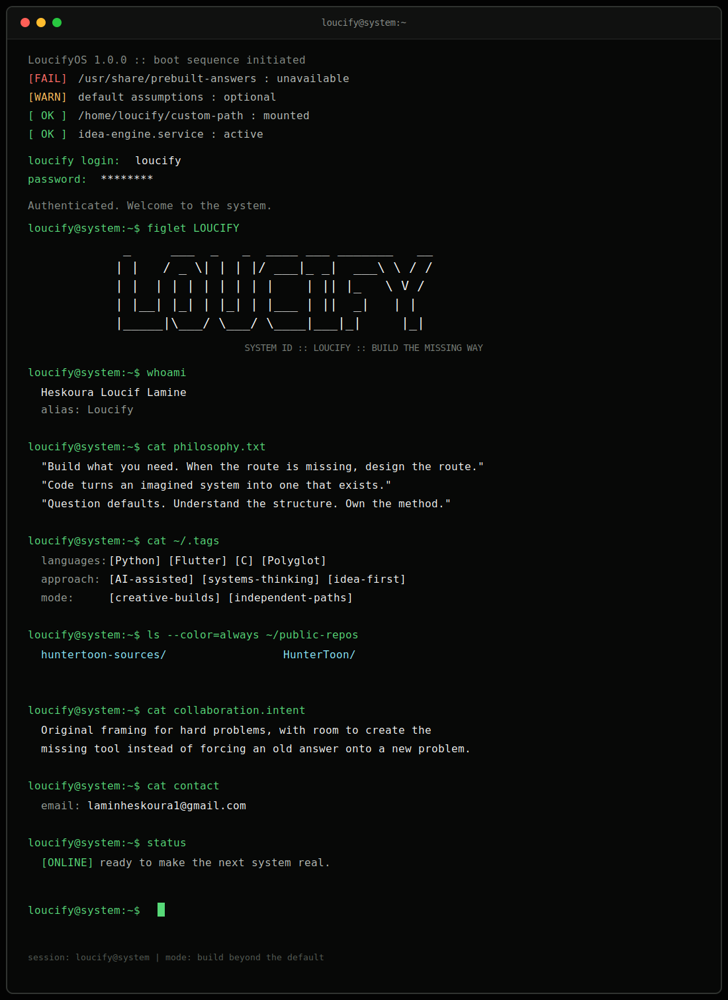
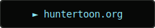
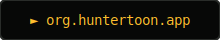

  
  
    
  
  
  &nbsp;&nbsp;&nbsp;
  

     

  <!-- PUBLIC_REPOS:START -->
  

    <a href="https://github.com/lamineheskoura/huntertoon-sources" style="color: #8be9fd; text-decoration: none;">► huntertoon-sources/</a>
    &nbsp;&nbsp;&nbsp;&nbsp;
    <a href="https://github.com/lamineheskoura/HunterToon" style="color: #8be9fd; text-decoration: none;">► HunterToon/</a>
  

  <!-- PUBLIC_REPOS:END -->

